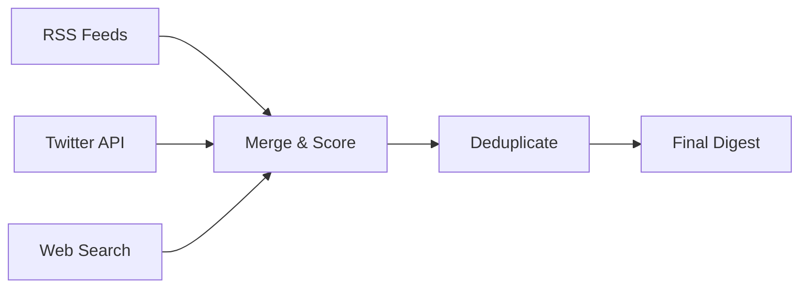

# Tech Digest Markdown Template

Standard markdown format for general use, GitHub, documentation sites, etc.

## Template Structure

```markdown
# Tech Digest - {{DATE}}

> {{total_articles}} articles from {{total_sources}} sources | Generated {{timestamp}}

## Summary

| Metric | Value |
|--------|--------|
| Sources | {{total_sources}} ({{rss_sources}} RSS, {{twitter_sources}} Twitter, {{web_sources}} Web) |
| Articles | {{total_articles}} across {{topics_count}} topics |
| Time Window | {{hours}} hours |
| Quality Scoring | ✅ Multi-source detection, deduplication applied |

{{#topics}}
## {{emoji}} {{label}}

> {{description}}

{{#articles}}
### [{{title}}]({{link}})

**Source:** {{source_name}} {{#priority}}⭐{{/priority}} • **Date:** {{date_formatted}} {{#multi_source}}• **Sources:** {{source_count}}{{/multi_source}}

{{#snippet}}
{{snippet}}
{{/snippet}}

**Tags:** {{topics_joined}} {{#quality_score}}• **Score:** {{quality_score}}{{/quality_score}}

{{/articles}}

{{/topics}}

## Technical Details

### Source Performance

| Source Type | Success Rate | Articles |
|-------------|--------------|-----------|
| RSS Feeds | {{rss_feeds_ok}}/{{rss_feeds_total}} ({{rss_success_rate}}%) | {{rss_article_count}} |
| Twitter | {{twitter_accounts_ok}}/{{twitter_accounts_total}} ({{twitter_success_rate}}%) | {{twitter_article_count}} |
| Web Search | {{web_topics_ok}}/{{web_topics_total}} ({{web_success_rate}}%) | {{web_article_count}} |

### Processing Pipeline

1. **Collection**: {{original_count}} articles collected from all sources
2. **Multi-source Merging**: {{multi_source_count}} articles found in multiple sources
3. **Deduplication**: {{duplicates_removed}} duplicates removed
4. **Quality Scoring**: Articles scored and ranked
5. **Final Output**: {{final_count}} articles across {{topics_count}} topics

### Top Scoring Articles

{{#top_articles}}
- [{{title}}]({{link}}) - **{{quality_score}}** points
  - Source: {{source_name}} {{#priority}}⭐{{/priority}}
  - Topics: {{topics_joined}}
  {{#multi_source}}- **Multi-source** ({{source_count}} sources){{/multi_source}}

{{/top_articles}}

---

**Archive Location:** `{{archive_path}}`  
**Next Digest:** {{next_digest_time}}  
📊 **Data Sources:** RSS {{rss_count}} | Twitter {{twitter_count}} | Reddit {{reddit_count}} | Web {{web_count}} | GitHub {{github_count}} releases | After dedup: {{merged_count}} articles

**Generated by:** Tech News Digest on {{timestamp}}
```

## Markdown-Specific Features

- **Tables**: Source performance and metrics tables
- **Proper heading hierarchy**: H1 > H2 > H3 structure
- **GitHub-compatible**: Works with GitHub, GitLab, etc.
- **Rich metadata**: Technical details and processing info
- **Blockquotes**: Topic descriptions and summary
- **Badge-style indicators**: Stars for priority sources
- **Expandable sections**: Can add `<details>` tags for long content
- **Cross-references**: Internal links to sections

## Example Output

```markdown
# Tech Digest - 2026-02-15

> 28 articles from 109 sources | Generated 2026-02-15 10:00:00 UTC

## Summary

| Metric | Value |
|--------|--------|
| Sources | 109 (46 RSS, 44 Twitter, 19 GitHub, 4 Web) |
| Articles | 28 across 4 topics |
| Time Window | 48 hours |
| Quality Scoring | ✅ Multi-source detection, deduplication applied |

## 🧠 LLM / Large Models

> Large Language Models, foundation models, model releases, benchmarks, and breakthroughs in generative AI

### [OpenAI releases GPT-5 with breakthrough reasoning capabilities](https://openai.com/blog/gpt5-announcement)

**Source:** OpenAI Blog ⭐ • **Date:** Feb 15, 2026 09:00 UTC • **Sources:** 3

GPT-5 introduces revolutionary chain-of-thought reasoning, achieving human-level performance on complex mathematical proofs and scientific reasoning tasks. The model features a 10x improvement in logical consistency and can maintain coherent reasoning across 100+ step problems.

**Tags:** llm, ai-agent, frontier-tech • **Score:** 12.5

### [Meta's Llama 3.1 achieves new MMLU benchmarks](https://ai.meta.com/blog/llama-31-release)

**Source:** Meta AI Blog • **Date:** Feb 14, 2026 16:30 UTC

Meta's latest Llama 3.1 model sets new state-of-the-art results on the MMLU benchmark, scoring 89.2% across diverse academic subjects. The model is now available under the modified commercial license for enterprises.

**Tags:** llm • **Score:** 8.0

## 🤖 AI Agent

> Autonomous agents, agent frameworks, AI assistants, and agentic AI systems

### [AutoGPT v0.5 introduces autonomous code deployment](https://github.com/Significant-Gravitas/AutoGPT/releases)

**Source:** GitHub Release • **Date:** Feb 15, 2026 12:15 UTC

**Tags:** ai-agent • **Score:** 6.5

## 💰 Cryptocurrency

> Bitcoin, Ethereum, DeFi, NFTs, blockchain technology, and crypto market developments

### [Bitcoin reaches new ATH at $67,000 amid ETF approval](https://coindesk.com/markets/btc-ath-etf)

**Source:** CoinDesk ⭐ • **Date:** Feb 15, 2026 08:30 UTC • **Sources:** 2

Bitcoin surged to a new all-time high of $67,000 following the SEC's approval of multiple spot Bitcoin ETFs. Trading volume exceeded $10B in the first hour, with institutional demand driving the rally.

**Tags:** crypto • **Score:** 11.0

## Technical Details

### Source Performance

| Source Type | Success Rate | Articles |
|-------------|--------------|-----------|
| RSS Feeds | 42/46 (91.3%) | 18 |
| Twitter | 40/44 (90.9%) | 7 |
| Web Search | 4/4 (100%) | 3 |

### Processing Pipeline

1. **Collection**: 43 articles collected from all sources
2. **Multi-source Merging**: 8 articles found in multiple sources
3. **Deduplication**: 15 duplicates removed
4. **Quality Scoring**: Articles scored and ranked
5. **Final Output**: 28 articles across 4 topics

### Top Scoring Articles

- [OpenAI releases GPT-5 with breakthrough reasoning capabilities](https://openai.com/blog/gpt5-announcement) - **12.5** points
  - Source: OpenAI Blog ⭐
  - Topics: llm, ai-agent, frontier-tech
  - **Multi-source** (3 sources)

- [Bitcoin reaches new ATH at $67,000 amid ETF approval](https://coindesk.com/markets/btc-ath-etf) - **11.0** points
  - Source: CoinDesk ⭐
  - Topics: crypto
  - **Multi-source** (2 sources)

- [Anthropic Claude 4 now supports 1M token context window](https://anthropic.com/news/claude-4-context) - **9.5** points
  - Source: Anthropic Blog ⭐
  - Topics: llm, frontier-tech

---

**Archive Location:** `workspace/archive/tech-news-digest/daily-2026-02-15.md`  
**Next Digest:** 2026-02-16 07:00:00 UTC  
📊 **Data Sources:** RSS 285 | Twitter 67 | Reddit 45 | Web 60 | GitHub 29 releases | After dedup: 95 articles

**Generated by:** Tech News Digest on 2026-02-15 10:00:00 UTC
```

## Variables

All variables from the email template plus:

### Display Formatting
- `{{date_formatted}}` - Human-readable date (Feb 15, 2026 09:00 UTC)
- `{{topics_joined}}` - Comma-separated topic tags
- `{{rss_success_rate}}` / `{{twitter_success_rate}}` / `{{web_success_rate}}` - Success percentages
- `{{rss_article_count}}` / `{{twitter_article_count}}` / `{{web_article_count}}` - Articles per source type
- `{{duplicates_removed}}` - Number of duplicates found and removed

### Processing Stats
- `{{original_count}}` - Articles before deduplication
- `{{final_count}}` - Articles after processing
- `{{multi_source_count}}` - Articles from multiple sources
- `{{top_articles}}` - Array of highest-scoring articles (top 3-5)

## Extensions

### GitHub Features
```markdown
<details>
<summary>🔧 Click to expand technical details</summary>

<!-- Technical content here -->

</details>
```

### Mermaid Diagrams
```markdown

```

### Table of Contents
```markdown
## Table of Contents
- [🧠 LLM / Large Models](#-llm--large-models)
- [🤖 AI Agent](#-ai-agent)
- [💰 Cryptocurrency](#-cryptocurrency)
- [Technical Details](#technical-details)
```